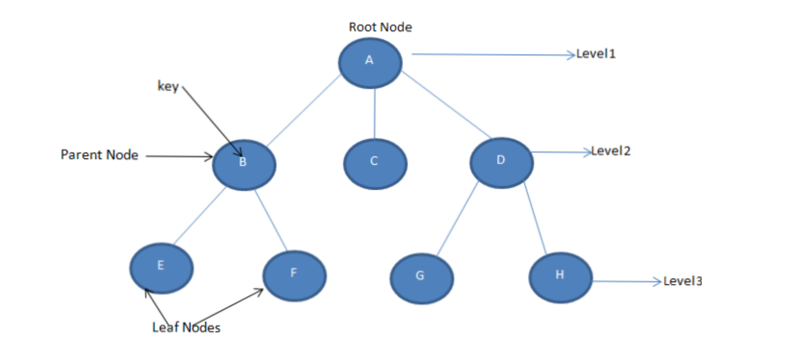

# Trees

Trees are a representation of a hierarchical format of data, trees are built with nodes that store elements, and every node has two components, data which are the element stored in the node, and reference is the exact location of the node, and in every tree, there is a top node called the Root, and below that node, there are two other nodes and they are positioned in opposite sides, one is in the right and the other is in the left, to better illustrate this concept there's an image below:



Trees are usually used to have a dynamic and efficient database structure to store their data.
## Creating a Binary Tree
To create a Tree and set up values to the database, you should write a code as follows:
```csharp
using System;
public class BinaryTreeNode
{
    //set up the format of the values of your tree here
    public string Value { get; set; }
    //set up the left node
    public BinaryTreeNode Left { get; set; }
    //set up the right node
    public BinaryTreeNode Right { get; set; }
}
public class Program
{
    public static void Main()
    {
        BinaryTreeNode root = new BinaryTreeNode
        {
            //set your root value
            Value = "metallica",
            //set up your left node values
            Left = new BinaryTreeNode
            {
                Value = "Master_of_Puppets",
                Left = new BinaryTreeNode { Value = "Death_Magnetic" },
                Right = new BinaryTreeNode { Value = "72_Seasons" }
            },
            //set up your right node values
            Right = new BinaryTreeNode
            {
                Value = "Ride_the_Lightning",
                Left = new BinaryTreeNode { Value = "Reload" },
                Right = new BinaryTreeNode { Value = "Megaforce" }
            }
        };
    }
}
```
with this code you will end up with a binary tree with 7 elements and all of them are going to be placed in this simple tree base structure.

## Adding elements to the binary tree
You can easily add more elements by creating new nodes and adding them to specific points in your binary list
code example:
```csharp
// Add more elements to the binary tree
        BinaryTreeNode newNode1 = new BinaryTreeNode { Value = "Slipknot" };
        BinaryTreeNode newNode2 = new BinaryTreeNode { Value = "Aerosmith" };

        root.Left.Left.Left = newNode1;
        root.Right.Left.Right = newNode2;

```
## Removing elements from the binary tree
to remove an element from your binary tree you will need to make use of if statements that are going to lead into recursions, it is more complex than the previous example but in the code below I will explain each step.
code example:
```csharp
//First let's suppose you want to remove the value "Aerosmith" from the binary tree, so you will turn that value into an argument to a function that is going to remove it, and you will also use the root of your binary tree as a positional argument.
    RemoveValue(root, "Aerosmith");
    //here we create the function and set up arguments
    //this function will work with the position in the hierarch(that is the root argument that we passed to the function above) that is going from the max value to the minimum value, so the function will go over the different levels of the tree to find the value that we desire to remove
    public static BinaryTreeNode RemoveValue(BinaryTreeNode node, string value)
    {
        //here we will return null in case the node is null
        if (node == null)
            return null;

        // If the node contains the value that we want to remove
        if (node.Value == value)
        {
            // Case 1: here is in case the Node has no child values
            if (node.Left == null && node.Right == null)
            {
                return null;
            }

            // Case 2: here is in case the Node has only one child value
            if (node.Left == null)
            {
                return node.Right;
            }

            if (node.Right == null)
            {
                return node.Left;
            }

            // Case 3: here is in case the Node has two children values
            // Find the minimum value on the right side of the binary tree using the FindingMinValeu() function
            string minValue = FindMinValue(node.Right);

            // Set the current node's value to be equal to the minimum value
            node.Value = minValue;

            // Remove the minimum value from the right side of the binary tree
            node.Right = RemoveValue(node.Right, minValue);
        }
        else if (string.Compare(value, node.Value) < 0)  //here you will use the .Compare() to see if the Value is less than the current node's value
        {
            node.Left = RemoveValue(node.Left, value);
        }
        else  // Value is greater than the current node's value
        {
            node.Right = RemoveValue(node.Right, value);
        }

        return node;
    }
    //here we are creating another function to find the minimum value in the binary tree
    public static string FindMinValue(BinaryTreeNode node)
    {
        string minValue = node.Value;

        while (node.Left != null)
        {
            minValue = node.Left.Value;
            node = node.Left;
        }

        return minValue;
    }
```
## Printing values of the binary tree:
You can print the values of your binary tree using a simple function that will use only one argument which is the root of your binary tree.
code-example:
```csharp
//Here we will print the values of the binary tree using Inorder traversal with this function below
        PrintInorder(root);
        public static void PrintInorder(BinaryTreeNode node)
    {
        if (node == null)
            return;

        //Here we will Traverse the left side of the tree
        PrintInorder(node.Left);

        //Here we will print the values of the nodes of the binary tree
        Console.Write(node.Value + " ");

        //Here we will Traverse the right side of the tree
        PrintInorder(node.Right);
    }
```
## Example: Spotify
With a binary tree database, you can create a tree with your favorite songs to listen in your phone, so with all the methods and functions listed and demonstrated in this tutorial you are capable of creating your Spotify tree.
## Problem to solve: Create a Spotify Linked List
With all the knowledge that you learn in this tutorial, you are ready to create your Spotify list with all the bands that you like in a binary tree structure, so you will create a binary tree and you will add all your favorite bands and you will add and remove one band from your binary tree.
```csharp
using System;

public class BinaryTreeNode
{
    //set up your values and nodes in this class
}

public class Program
{
    public static void Main()
    {
       //set the values to your nodes to make part of your tree
        // Print the values of the binary tree using Inorder traversal
        // Remove the value of your choice from the binary tree
        // Print the updated values of the binary tree using Inorder traversal
        //call your functions here
    }
//create a function that will print your values
//create all the other functions to get your element removed
}
```
## sample solution:
[solution](/cse_final_p_tutorial/tree_solution/Program.cs)